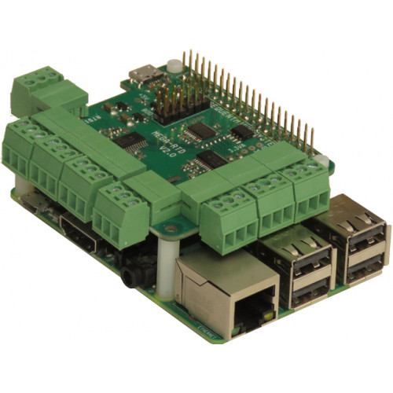

[](https://www.sequentmicrosystems.com)

# rtd-rpi

This is the command to control [MEGA-RTD Stackable Card for Raspberry Pi](https://sequentmicrosystems.com/index.php?route=product/product&path=33&product_id=66)



Don't forget to enable I2C communication:
```bash
~$ sudo raspi-config
```

## Usage

```bash
~$ git clone https://github.com/SequentMicrosystems/rtd-rpi.git
~$ cd rtd-rpi/
~/rtd-rpi$ sudo make install
```

Now you can access all the functions of the relays board through the command "rtd". Use -h option for help:
```bash
~$ rtd -h
```

If you clone the repository any update can be made with the following commands:

```bash
~$ cd rtd-rpi/  
~/rtd-rpi$ git pull
~/rtd-rpi$ sudo make install
```  
