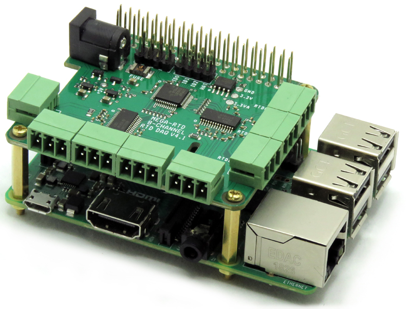

[](https://www.sequentmicrosystems.com)

# rtd-rpi


This is the command to control [RTD Data Acquisition Stackable Card for Raspberry Pi](https://sequentmicrosystems.com/product/rtd-data-acquisition-stackable-card-for-rpi/).

First enable I2C communication:
```bash
~$ sudo raspi-config
```

## Usage

```bash
~$ git clone https://github.com/SequentMicrosystems/rtd-rpi.git
~$ cd rtd-rpi/
~/rtd-rpi$ sudo make install
```

Now you can access all the functions of the relays board through the command "rtd". Use -h option for help:
```bash
~$ rtd -h
```

If you clone the repository any update can be made with the following commands:

```bash
~$ cd rtd-rpi/  
~/rtd-rpi$ git pull
~/rtd-rpi$ sudo make install
```  

Python library availble [here](https://github.com/SequentMicrosystems/rtd-rpi/tree/master/python).

Node-Red example based on exe-node [here](https://github.com/SequentMicrosystems/rtd-rpi/tree/master/node-red)

Node-Red [rtd node](https://github.com/SequentMicrosystems/rtd-rpi/tree/master/node-red-contrib-sm-rtd)
